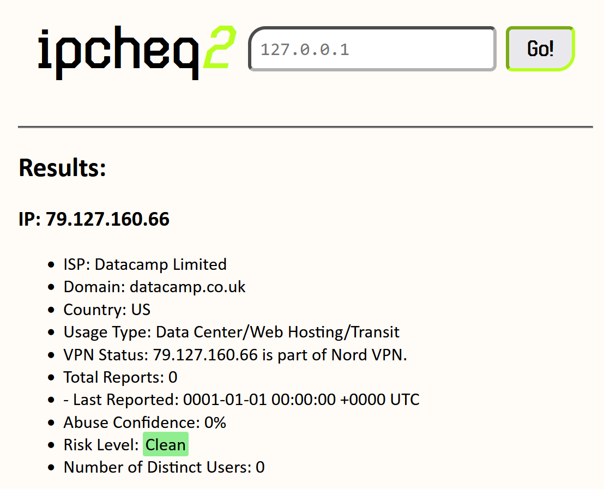

# ipcheq2

Aggregate data from AbuseIPDB and Spur to investigate IPs!



## Features
- Search results history!
- IPv4 and IPv6 support!
- Concise, distraction-free results without any marketing!
- Linux and Windows both supported!

## Quick Start with Docker

### Using Docker Run
```bash
# supply an abuseipdb api key
docker run -p 8080:8080 -e ABIPDBKEY=your_api_key_here ghcr.io/tlop503/ipcheq2:latest
```

### Using Docker Compose
1. Create a `docker-compose.yml` file:
```yaml
version: '3.8'
services:
  ipcheq2:
    image: ghcr.io/tlop503/ipcheq2:latest
    ports:
      - "8080:8080"
    environment:
      - ABIPDBKEY=your_api_key_here
    restart: unless-stopped
```

2. Run the application:
```bash
docker-compose up -d
```

## Run locally
1. Download exe or elf from the latest [release](https://github.com/tlop503/ipcheq2/releases/latest).
2. Create a .env file with an AbuseIPDB API Key (see `.env.example`).
3. Place the binary and .env in the same directory and run! ipcheq2 will serve on localhost:8080.

## Development Setup

### Prerequisites
- Go 1.23+
- AbuseIPDB API key

### Local Development
1. Clone the repository:
```bash
git clone https://github.com/tlop503/ipcheq2.git
cd ipcheq2
```

2. Create a `.env` file:
```bash
cp .env.example .env
# Edit .env and add your ABIPDBKEY
```

3. Run the application:
```bash
go run main.go
# or
go build . # inside project
./ipcheq2
```

4. Open your browser to `http://localhost:8080`


## Deployment

### GitHub Container Registry
This project is automatically built and published to GitHub Container Registry via GitHub Actions.

### Manual Build
```bash
docker build -t ipcheq2 .
docker run -p 8080:8080 -e ABIPDBKEY=your_api_key_here ipcheq2
```